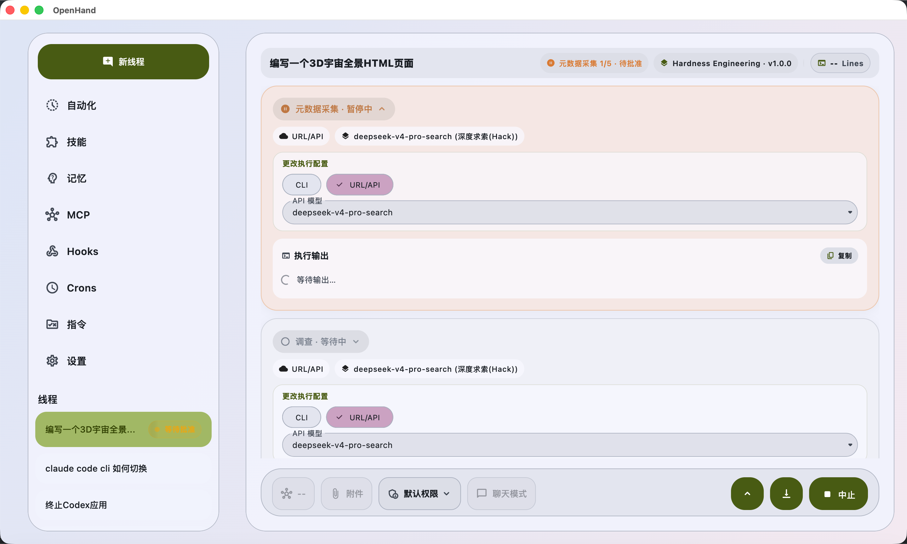

<div align="center">
  

# OpenHand

**A self-hosted AI agent workbench for the desktop**

Orchestrate 20+ model protocols, programmable tools, skills, MCP servers, hooks and cron jobs — all inside a single native Flutter app.

[](https://flutter.dev)
[](https://dart.dev)
[](#-download--run)
[](#)
[](README.md)
[](README.en.md)

</div>

> 🤝 **OpenHand** = Open + Hand — give the AI's hands back to developers: switch models freely, plug tools in and out, keep prompts and conversations 100% local, and make every automation transparent and controllable.

---

## 📑 Table of Contents

- [✨ Highlights](#-highlights)
- [🖼 Screenshots](#-screenshots)
- [🚀 Core Features](#-core-features)
- [🧠 Built-in AI Tools](#-built-in-ai-tools)
- [🌐 Supported Model Protocols](#-supported-model-protocols)
- [🧩 Thread Templates](#-thread-templates)
- [🔌 MCP / Skills / Hooks / Crons](#-mcp--skills--hooks--crons)
- [⌨️ Keyboard Shortcuts](#️-keyboard-shortcuts)
- [📜 File Mutation Ledger](#-file-mutation-ledger)
- [🏗 Architecture](#-architecture)
- [📦 Download & Run](#-download--run)
- [🛠 Developer Guide](#-developer-guide)
- [🗂 Project Layout](#-project-layout)
- [🌍 Internationalization](#-internationalization)
- [🤝 Contributing](#-contributing)
- [❓ FAQ](#-faq)
- [📜 License](#-license)

---

## ✨ Highlights

| | |
|---|---|
| 🪐 **Multi-protocol** | One UI for OpenAI / Claude / Gemini / DeepSeek / Qwen / Kimi / GLM / Grok / Ollama / vLLM / SGLang / ByteDance Seed / StepFun / MiniMax / LongCat / JoyCode / Wenxin / Meta / Mimo / Hunyuan — **20+ protocols**. |
| 🧰 **Full toolchain** | 25+ built-in tools: Bash, Read/Write/Edit, Grep (bundled ripgrep), Glob, LSP, Git, WebFetch, WebSearch, CodebaseSearch, TodoWrite, Memory, Task, Notebook, SkillManager… |
| 🧠 **DSML fallback** | When the model lacks native function-calling, OpenHand auto-injects the DSML invocation spec so even raw-text models can drive the toolchain reliably. |
| 🛡 **Desktop-grade safety** | Allow/deny command rules, every external process funneled through `safe_subprocess` with hard timeout + `SIGKILL` — no more macOS Apple Events freezing the IME. |
| 🧩 **MCP / Hooks / Crons / Skills** | One-stop management for Model Context Protocol servers, lifecycle hooks, cron automation, and a skills market. |
| 📚 **Self-learning agent** | Hermes Talker template + Self-Learning scheduler distill long-term insights from recent sessions into the user profile and `自主学习`-tagged memories. |
| 🏎 **Performance-tuned** | LRU code-block highlight cache, deferred parsing for >120 KB markdown, parallel boot, 4 MiB SSE buffer, one-shot appear animations. |
| 🌍 **Local-first** | All sessions, memories, skills and MCP configs live in a local SQLite. Multi-language UI (zh-Hans / zh-Hant / en / ja / fr / de). |

---

## 🖼 Screenshots

> ℹ️ The paths below are placeholders. Drop your screenshots into `docs/screenshots/` keeping the same file names.

<table>
  <tr>
    <td align="center"><br/><sub><b>Main chat · multi-thread sidebar</b></sub></td>
    <td align="center"><br/><sub><b>Programming Expert · workspace view</b></sub></td>
  </tr>
  <tr>
    <td align="center"><br/><sub><b>Hardness Engineering · phased pipeline</b></sub></td>
    <td align="center"><br/><sub><b>MCP server management</b></sub></td>
  </tr>
  <tr>
    <td align="center"><br/><sub><b>Skills market</b></sub></td>
    <td align="center"><br/><sub><b>Models / protocols / tools / command rules</b></sub></td>
  </tr>
</table>

---

## 🚀 Core Features

### 1. Multi-thread workbench
- Many parallel sessions, each with its own **model / protocol / template / tool toggles**.
- **Image / audio / video** creation modes auto-routed per protocol (OpenAI Sora, MiniMax T2V/T2A, Qwen DashScope async, GLM CogVideoX, …).
- **Session export**: right-click a thread → export JSONL with role / kind filter, message range, deleted toggle, pretty-print.

### 2. Smart context compression
- Compression only kicks in for turns the model has already consumed. Raw `Read` / `Bash` bodies are always preserved to avoid write-loops.
- Per-template `compression_summary_instructions.md`.

### 3. Plan approval mode
- The model emits a **Plan** first, then waits for your "continue / ok / yes" approval before executing.
- Approval phrases use exact-set matching to avoid false positives like "OK but…".

### 4. Self-learning & memory
- **Memory** tool: `list / append / upsert_profile / update / delete` with tags and JSON content.
- **Hermes Talker** template + system cron `self_learning.hermes_talker` (`*/5 * * * *`) scans the last 7 days of sessions and dispatches a restricted sub-agent to distill durable insights.
- Global **Memory Tone Policy**: when a reply uses stored memories, never say "I remember…" — weave it in naturally.

### 5. Programming Expert
- Embedded **workspace view**: project browser, recent projects, file hover preview, jump-to-file, write-command dialog.
- **LSP backend catalog** with auto-install for Dart / TypeScript / Python / Rust / Go and more.
- Tool-call cards animated with a fade-in + height transition.

### 6. Hardness Engineering
- Phased (Plan → Implement → Verify → Recap) pipeline with per-phase tool affinity.
- Built-in CLI installer / login helper, all external processes routed through `safe_subprocess`.
- Dashboard split into 13 `.part.dart` UI subtrees for maintainability.
- ToolSearch load history is bucketed per phase-session as an LRU cache; the
  cap is adjustable under **Settings → MCP** (`hardnessToolSearchHistoryMaxPhases`,
  default 8, range 1..64). Older phase buckets are evicted automatically so
  long sessions never grow unbounded.

### 7. Desktop-grade UX
- **Global shortcuts**: `Ctrl+P` toggles the panel, `Ctrl+Enter` sends, `@` triggers mention/skill picker.
- Slash-command parser, paste attachments, SVG rendering, KaTeX math.
- **Appear animations** unified via `AppearOnce` + `AppearTracker` — no list-perf hit.

### 8. Web Reverse Expert
- Drives a real external Chrome / Chromium over **CDP**, with auto-reconnect that restores persistent headers, blocked URLs, screencast and page targets.
- **17-tab dashboard**: Browser / Overview / Network / Console / Sources / Breakpoints / Live / Snippets / Elements / Hooks / Crons / Crypto / Performance / Memory / Application / Security / Recorder — last-active tab is persisted per session.
- **40+ advanced panels**: network breakpoints, mock rules, DOM mutation watch, SourceMap reverse-resolve (VLQ decode → original source:line:col), CSS rule coverage (find dead CSS), frame-tree viewer, CORS preflight diagnostics, console error clustering, CDP raw-command console, console REPL, heap snapshot, performance trace (with early Stop), device emulation, CPU throttling, storage manager (Cookies / Local / Session / IndexedDB editing), WebSocket frame viewer & replay, batch request replayer, input-event simulator, Service Worker debugger…
- Ships 9 ready-to-use **JS snippets** under [assets/prompts/web_reverse_expert/snippets/](assets/prompts/web_reverse_expert/snippets/) (`hook_crypto.js` / `hook_payload.js` / `hook_storage.js` / `hook_websocket.js` / `hook_postmessage.js` / `hook_console_errors.js` / `hook_dom_mutation.js` / `repl_dump_frames.js` / `repl_dump_storage.js`), all using the `__OH_*__` prefix for easy grep.
- 5-stage workflow **Recon → Plan → Capture → Reverse → Reproduce**; reproduce scripts default to `WD/.web_reverse/<session_id>/scripts/`.

---

## 🧠 Built-in AI Tools

| Category | Tools | Notes |
|---|---|---|
| File | `Read` `Write` `Edit` `MultiEdit` `LS` `Glob` `Grep`* `NotebookEdit` `DeleteFile` | `Grep` always uses the bundled `vendor/ripgrep` binary. |
| Code | `CodebaseSearch` `LSP` `ReadLints` `Git` | LSP supports auto-installing language servers. |
| Execution | `Bash` `Task` | `Bash` goes through allow/deny rules + `safe_subprocess` timeout. |
| Network | `WebFetch` `WebSearch` | Unified host/timeout config. |
| Agentic | `TodoWrite` `Memory` `SkillManager` `ExitPlanMode` `AskUserChoice` | Plans / memories / skills / confirmations. |

> If a model lacks native function-calling, OpenHand appends the DSML invocation spec at the end of the system prompt and forbids hallucinated forms like `##TOOL_CALL##` / unknown tool names / markdown-wrapped calls.

---

## 🌐 Supported Model Protocols

| International | Chinese | Self-hosted |
|---|---|---|
| OpenAI · Claude · Gemini · Grok · Meta | DeepSeek · Qwen · Kimi · GLM · ByteDance Seed · StepFun · MiniMax · LongCat · JoyCode · Wenxin · Hunyuan · Mimo | Ollama · vLLM · SGLang |

For each protocol OpenHand bundles:
- A **model profile catalog** (max context, tool-call support, vision/audio/video capability).
- **Token-usage** parsing.
- **Streaming / non-streaming** auto-adaptation.
- **Multi-modal endpoint routing** (image / audio / video generation).

---

## 🧩 Thread Templates

| Template | Use case | Highlights |
|---|---|---|
| 🪄 **Default** | General chat | Minimal toolset, cleanest context. |
| 💻 **Programming Expert** | Read/edit/refactor code | Full toolset (Bash/LSP/Grep/Edit/...) + workspace view. |
| 🛠 **Hardness Engineering** | Complex multi-phase tasks | Plan→Implement→Verify→Recap phased pipeline. |
| 💬 **Hermes Talker** | Casual self-learning chat | `memory` + `skill_manager` + background cron distillation. |
| 🌐 **Web Reverse Expert** | Browser API reversing / param recovery / repro scripts | Real Chrome + CDP + 17-tab dashboard + 40+ advanced panels + JS snippet library. |

> Template prompts live under [assets/prompts/](assets/prompts/). Each template ships `system_instructions.md`, `developer_instructions.md`, and `compression_summary_instructions.md`.

---

## 🔌 MCP / Skills / Hooks / Crons

| Module | Entry | Capability |
|---|---|---|
| **MCP** | Sidebar → MCP | Add stdio / SSE / WebSocket Model Context Protocol servers; tools auto-injected into the session catalog. Large MCP tool sets support **lazy loading** (see [docs/mcp-lazy-loading.md](docs/mcp-lazy-loading.md)). |
| **Skills** | Sidebar → Skills | Built-in skills market and local skill packs; the `SkillManager` tool lets the AI mount skills on demand. |
| **Hooks** | Sidebar → Hooks | Run shell on lifecycle events (e.g. `PostToolUse`, `PreCompact`) via `HooksExecutor`. |
| **Crons** | Sidebar → Crons | Cron-expression scheduler + history cleanup worker. Supports `script` / `agent` jobs; system jobs are locked from deletion. |
| **Memory** | Sidebar → Memory | Tagged entries + user profile; integrates with Hermes Talker. |
| **Instructions** | Sidebar → Instructions | Global / workspace prompt snippets injected into the system prompt. |

---

## ⌨️ Keyboard Shortcuts

| Shortcut | Action |
|---|---|
| `Ctrl + Enter` | Send the current message |
| `Ctrl + P` | Toggle command panel |
| `@` | Trigger mention / skill / model picker |
| `/` | Trigger slash-command parsing |
| `Esc` | Cancel dialog / abort streaming |

> On macOS `Ctrl` maps to `⌃` (not `⌘`) to avoid conflicting with system text-editing shortcuts.

---

## 📜 File Mutation Ledger

OpenHand ships with a Codex-parity ledger that records every file written by
the `Write` / `Edit` / `MultiEdit` / `DeleteFile` tools. Each entry stores
content-addressed (SHA-256) before/after blobs plus metadata.

- **Storage**: `~/.openhand/file_history/`
  - `blobs/` — content-addressed snapshots (de-duplicated)
  - `sessions/<session-id>/ledger.jsonl` — append-only timeline
  - `config.json` — retention policy
- **Multi-file card**: every assistant tool-call renders an aggregated card
  listing the touched files, per-line inline diff, and per-file undo / redo.
- **Cascade undo**: undoing record X for file F automatically invalidates the
  later records (Y / Z) on F so you never end up with a hole.
- **Copy all diff**: the toolbar 📋 button copies a unified markdown bundle of
  every file in the current tool-call — paste straight into a PR description.
- **Shortcut**: `Ctrl + Shift + Z` undoes the latest ledger record in the
  current session (same on macOS via `⌃ ⇧ Z`). The confirmation SnackBar
  carries a one-tap **Redo** action.
- **Data cleanup**: Settings → Data cleanup exposes a dedicated ledger card
  with live `N sessions · M records · K blobs` stats, sliders for retention
  days + per-file version cap, and a **Prune now** button that applies the
  current thresholds immediately.
- **Large-text guard**: diffs over 256 KB skip the full line-by-line render
  and degrade to a `<file too large; sha=…>` placeholder to keep the UI
  responsive.

> Card and settings UI are fully localised (en / zh / zh-Hans / zh-Hant / ja /
> de / fr).

---

## 🏗 Architecture

```
┌────────────────────────────────────────────────────────────────────────────┐
│                            Flutter UI (lib/features)                       │
│  home · ai · hardness · settings · mcp · skills · memory · crons · hooks   │
└──────────────┬─────────────────────────────────────────────┬───────────────┘
               │                                             │
        ┌──────▼──────┐                              ┌───────▼────────┐
        │  Controllers │  ← Provider/ChangeNotifier  │  Renderers     │
        │  (state)     │                              │  (markdown,    │
        └──────┬──────┘                              │   highlight,   │
               │                                      │   katex, svg)  │
   ┌───────────┼───────────────────────────────┐     └───────┬────────┘
   │           │                               │             │
┌──▼──┐   ┌────▼─────┐   ┌──────────────┐   ┌─▼───────────┐ │
│ AI  │   │  Tools   │   │ MCP / Skills │   │ Persistence │ │
│Chat │   │ Registry │   │ / Hooks /    │   │  SQLite     │ │
│Svc  │   │ + DSML   │   │   Crons      │   │  (sqflite_  │ │
└──┬──┘   │ Parser   │   └──────┬───────┘   │   common_   │ │
   │      └────┬─────┘          │           │    ffi)     │ │
   │           │                │           └─────────────┘ │
   │   ┌───────▼──────────┐  ┌──▼─────────┐                 │
   │   │ Builtin Tools    │  │ External   │                 │
   │   │ (Bash/Read/Edit/ │  │ Processes  │  ← safe_        │
   │   │  Grep/LSP/Git…)  │  │ (osascript │    subprocess   │
   │   └──────────────────┘  │  / rg /    │    hard timeout │
   │                         │  npx / …)  │    + SIGKILL    │
   │                         └────────────┘                 │
   │                                                         │
   └──────────► Protocol Adapters (OpenAI/Claude/Gemini/…)──┘
```

Key mechanisms:
- **`safe_subprocess.runProcessWithTimeout`** is the single funnel for all external processes; enforces timeout + child kill.
- **`AiToolRuntimeService.toolRegistry`** is exposed to `AiSessionController` so per-tool runtime fields can be patched live.
- **`AppearOnce` + `AppearTracker`** — 220 ms FadeTransition + paint-time vertical translate, safe inside Slivers.
- **Parallel boot**: 7 controllers initialize concurrently with 3 `openhand.boot.*` Timeline markers visible in DevTools.

---

## 📦 Download & Run

> No prebuilt binaries yet — build from source.

### System requirements

| Platform | Minimum |
|---|---|
| macOS | 12 Monterey (Apple Silicon recommended) |
| Windows | Windows 10 21H2 |
| Linux | Ubuntu 22.04 / Fedora 38 (GTK 3) |

### Build

```bash
git clone https://github.com/<your-org>/openhand.git
cd openhand
flutter pub get

# macOS
flutter build macos --release
open build/macos/Build/Products/Release/openhand.app

# Windows
flutter build windows --release

# Linux
flutter build linux --release
```

---

## 🛠 Developer Guide

### 1. Toolchain

```bash
flutter --version          # >= 3.27
dart --version             # ^3.11
flutter doctor             # ensure desktop toolchain is OK
```

### 2. Dependencies

```bash
flutter pub get
```

> ⚠️ The project uses [`pub hooks`](pubspec.yaml) to make `sqlite3` use the system library (`source: system`) so builds don't pull binaries from GitHub.

### 3. Run

```bash
flutter run -d macos       # or windows / linux
```

### 4. Quality gates

Keep `flutter analyze` at 0 issues before pushing:

```bash
flutter analyze 2>&1 | tail -5
```

### 5. Localization

After editing `lib/l10n/app_*.arb`:

```bash
flutter gen-l10n
```

---

## 🗂 Project Layout

```
lib/
├── main.dart                       # Bootstrap (parallel boot + zone error guard)
├── app/
│   ├── openhand_app.dart           # MaterialApp + Localization
│   ├── model/                      # AppInfo, etc.
│   ├── state/                      # Global SettingsController
│   ├── support/                    # silent_log, safe_subprocess, runtime_context
│   └── theme/                      # Theme & palette
├── features/
│   ├── ai/                         # Session engine
│   │   ├── ai_session_controller.dart
│   │   ├── tools/                  # 25+ built-in tools
│   │   ├── service/                # ChatService / DSML / Hook / Self-Learning…
│   │   └── model/                  # Protocols, model catalog, token usage, templates
│   ├── home/                       # Main UI (chat, sidebar, workspace, dialogs)
│   ├── hardness/                   # Hardness Engineering template (13 part files)
│   ├── mcp/                        # MCP server management
│   ├── skills/                     # Skills market
│   ├── memory/                     # Memory store
│   ├── crons/                      # Scheduled jobs
│   ├── hooks/                      # Lifecycle hooks
│   ├── instructions/               # Prompt snippets
│   └── settings/                   # Settings center
├── shared/
│   ├── data/                       # SQLite data layer
│   ├── net/                        # Networking
│   └── widgets/                    # Reusable widgets (AppearOnce, AppearTracker…)
└── l10n/                           # ARB + generated AppLocalizations
assets/
├── branding/openhand_logo.png
└── prompts/                        # Per-template system / developer / compression prompts
vendor/
└── ripgrep/                        # Cross-platform rg binary (Grep tool backend)
scripts/
└── copy_vendor.sh                  # Sync vendor binaries
```

---

## 🌍 Internationalization

| Language | Status |
|---|---|
| Simplified Chinese `zh_Hans` | ✅ default |
| Traditional Chinese `zh_Hant` | ✅ |
| English `en` | ✅ |
| Japanese `ja` | ✅ |
| French `fr` | ✅ |
| German `de` | ✅ |

To add a language: create `lib/l10n/app_<locale>.arb`, run `flutter gen-l10n`, then register it in the settings panel.

---

## 🤝 Contributing

Issues and PRs welcome. Please follow these conventions:

1. **Commit messages must be in Simplified Chinese**, verb-led, stating the goal + impact.
   - Example: `修复机器专家弹窗导致全局输入框失焦/无法输入粘贴的问题`
2. Run `flutter analyze` before pushing and keep it clean.
3. All external processes must go through [lib/app/support/safe_subprocess.dart](lib/app/support/safe_subprocess.dart). Never use bare `Process.run(...).timeout(...)`.
4. Use [silentLog](lib/app/support/silent_log.dart) instead of `catch (_) {}` for silent error swallowing.
5. Add UI strings to `lib/l10n/app_zh.arb` first, then run `flutter gen-l10n` to scaffold other locales.

---

## ❓ FAQ

**Q: Why does my model keep hallucinating `##TOOL_CALL##` blocks?**
A: The model lacks native function-calling. OpenHand already injects the DSML spec and forbids `##TOOL_CALL##` / fabricated names / markdown-wrapped calls. Make sure the model isn't mis-flagged as `supportsToolCalls=true`.

**Q: Dialog `TextField` suddenly refuses paste/input — what's wrong?**
A: 99% of the time you called `osascript` directly without `safe_subprocess`. Stale Apple Events break the IMK input context. Use `runProcessWithTimeout` and defer it to `addPostFrameCallback`.

**Q: Are sessions uploaded to the cloud?**
A: **No.** Everything lives in the local SQLite. Model requests only go to the endpoints you configured.

**Q: Can I disable Hermes Talker self-learning?**
A: Yes — toggle the master switch under **Settings → Hermes Talker**, or disable the `self_learning.hermes_talker` cron entry (system jobs cannot be deleted but can be disabled).

---

## 📜 License

> ⚠️ This repository does not yet ship a `LICENSE` file. Before public distribution please add one (MIT or Apache-2.0 recommended) and credit third-party binaries (e.g. `vendor/ripgrep` keeps its original BurntSushi license).

---

<div align="center">
<sub>Built with ❤️ in Flutter · Hand back to developers · OpenHand</sub>
</div>
