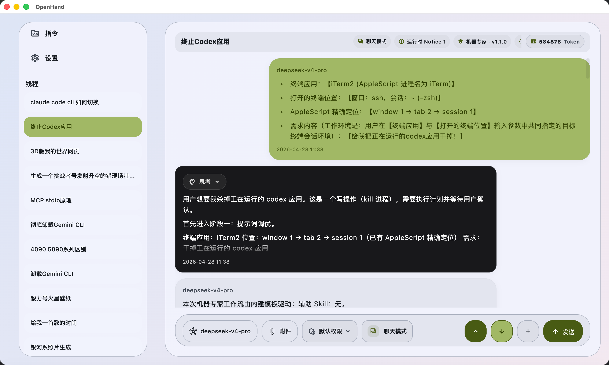
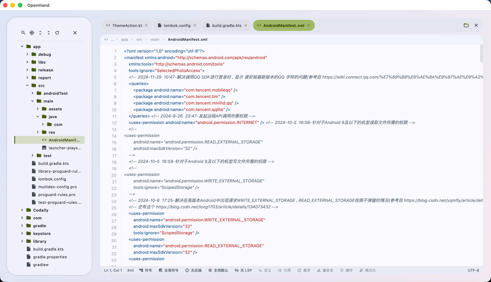
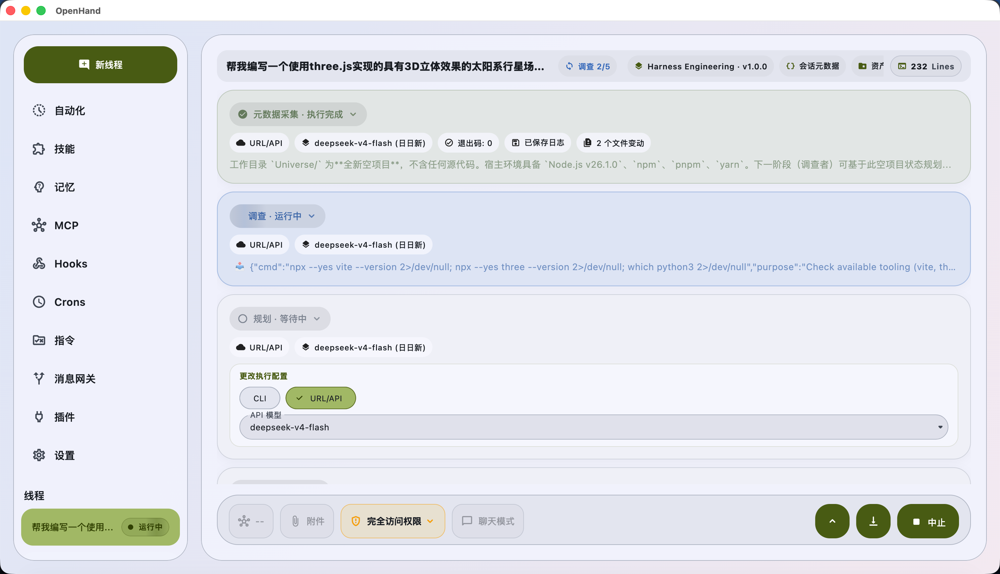
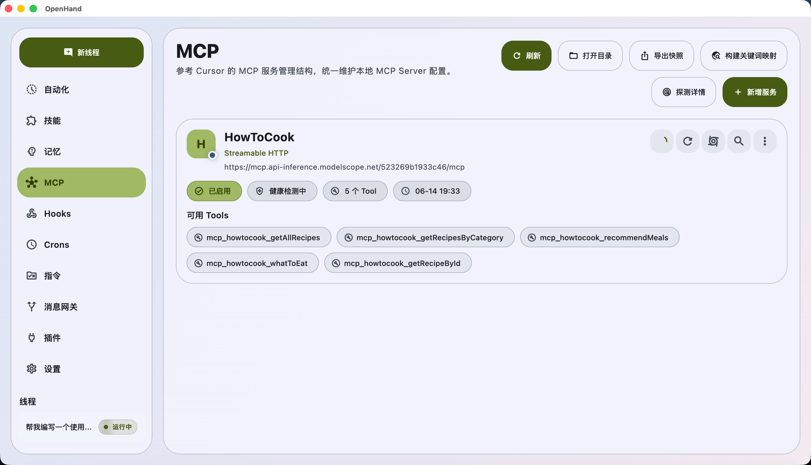
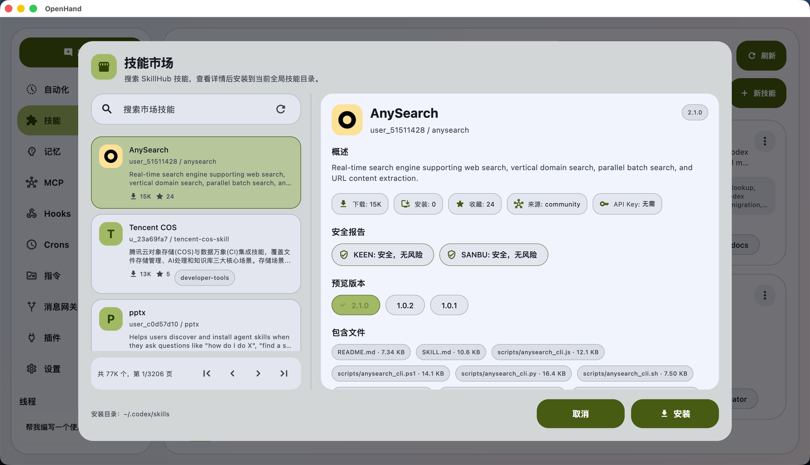
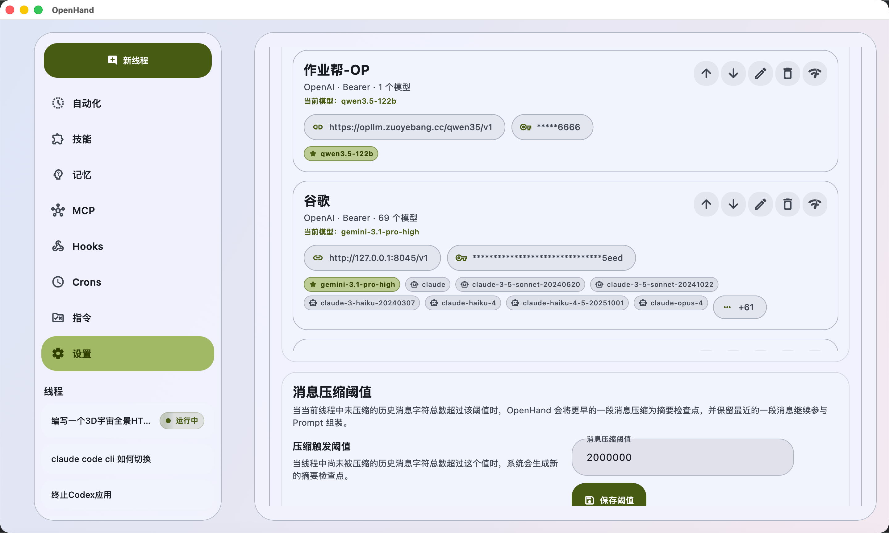

<div align="center">
  

# OpenHand

[](https://flutter.dev)
[](https://dart.dev)
[](#运行环境)
[](#web-消息平台)
[](#)
[](README.md)
[](README.en.md)

<p>
  <a href="README.md">简体中文</a>
  ·
  <a href="README.en.md">English</a>
</p>

</div>

OpenHand 是一款本地优先的跨平台 AI 工作台。它把多模型会话、工具执行、MCP、技能、记忆、知识库、插件、Hooks、Crons、线程模板和 Web 消息平台整合到一个 Flutter 原生应用里，用来承载真实、可控、可审计、可长期维护的 AI 工作流。

## 项目定位

OpenHand 不只是聊天窗口，而是面向开发者、研究人员和团队的本地 AI 操作台。它适合以下场景：

- 日常 AI 对话、知识整理、用户画像和长期记忆沉淀。
- 代码阅读、修改、调试、项目上下文分析和端到端工程推进。
- 多角色工程编排、任务审计、执行记录和验收复盘。
- MCP 服务、插件、技能、提示词、命令规则和本地配置的统一管理。
- Web / Android 授权逆向、安全研究、接口分析和复现脚本产出。
- 通过 Web 消息平台在浏览器中访问会话、文件、插件、日志、运维和工具面板。

## 核心能力

| 能力 | 说明 |
|---|---|
| 多模型接入 | 支持 OpenAI、Claude、Gemini、DeepSeek、Qwen、Kimi、GLM、Grok、Ollama、vLLM、SGLang、MiniMax、Seed、StepFun、Wenxin、Hunyuan、Meta、Mimo 等协议或 OpenAI 兼容服务。 |
| 工具运行时 | 内置文件读写编辑、diff 应用、Bash / 后台命令、Git、LSP、WebFetch、WebSearch、ToolSearch、Todo、Task、Memory、Knowledge、Skill Manager、机器终端等工具。 |
| 可控执行 | 支持命令 allow / deny 规则、写命令确认、沙箱设置、超时、取消、强制终止、工具输出压缩、审计元数据和 token / 成本统计。 |
| MCP 与 ToolSearch | 管理 MCP server、stdio 进程、健康检查、工具目录、关键词索引、懒加载、历史导入导出和取消重放。 |
| 技能与插件 | 管理本地 Claude Code skills、技能市场、插件扫描、安装、更新、卸载、依赖关系和运行状态。 |
| 记忆与自学习 | 管理用户长期记忆、用户画像和 Hermes Talker 自学习定时任务，帮助对话持续个性化但不打断回复。 |
| 知识库 | 导入 Markdown、Office、PDF、HTML、CSV、JSON、TOML、YAML、TXT、代码文件或笔记，使用 Qdrant 建立本地向量索引并提供检索详情。 |
| 自动化 | Hooks 覆盖会话生命周期事件，Crons 覆盖定时任务、后台维护、系统托管任务和执行历史。 |
| 高级工作台 | 内置 Web 逆向 CDP Dashboard、Android 逆向 Dashboard、Harness Engineering 和本地机器终端。 |
| 桌面体验 | 支持多线程会话、附件、Markdown / KaTeX / HTML 渲染、代码高亮、快捷键、主题、动效设置、多语言和丝滑的弹窗/页面过渡。 |

## 应用截图

<table>
  <tr>
    <td align="center"><br/><sub><b>主聊天</b></sub></td>
    <td align="center"><br/><sub><b>编程专家</b></sub></td>
  </tr>
  <tr>
    <td align="center"><br/><sub><b>Harness Engineering</b></sub></td>
    <td align="center"><br/><sub><b>MCP 服务</b></sub></td>
  </tr>
  <tr>
    <td align="center"><br/><sub><b>技能市场</b></sub></td>
    <td align="center"><br/><sub><b>设置中心</b></sub></td>
  </tr>
</table>

## 线程模板

| 模板 | 用途 |
|---|---|
| 默认助手 | Claude Code 风格的通用模板，适合工具辅助工作、MCP 使用和本地技能激活。 |
| 机器专家 | 以本地终端为主要执行面，面向目标机器操作、排障和自动化任务。 |
| 编程专家 | 面向代码阅读、修改、调试、上下文恢复、子代理隔离、对抗验证和工程交付。 |
| Harness Engineering | 多角色工程编排，将任务拆成调查、规划、实施、验收等阶段并持久化上下文。 |
| Hermes Talker | 在通用助手基础上加入 skill_manager、memory 和自学习能力，适合长期陪伴式对话。 |
| Web 逆向专家 | 使用 Chrome / Chromium + CDP 分析授权站点的接口、参数、存储、网络和复现脚本。 |
| Android 逆向专家 | 使用 ADB、Frida、jadx / apktool、mitmproxy 等能力完成授权 Android 分析。 |
| Siri 助手 | Apple 设备特化模板，继承默认能力并使用 Siri 风格系统提示词，仅在 Apple 平台展示。 |

## 工作台模块

- `Workspace`：主会话、侧栏、composer、transcript、附件、工具调用卡片、文件变更预览和快捷命令。
- `MCP`：服务配置、连接状态、工具发现、懒加载、ToolSearch 历史和 stdio 运维。
- `Skills`：本地技能扫描、安装、卸载、市场入口和默认 prompt 展示。
- `Memory`：用户画像、长期记忆、增删改查和运行时上下文注入。
- `Knowledge Base`：文档解析、分块、embedding、Qdrant 向量库、检索详情和向量分布。
- `Plugin Service`：插件生命周期、依赖管理、Qdrant / Android 工具链等插件化能力。
- `Message Gateway`：Web 端访问、鉴权、模型白名单、命令审批、文件写入审批和日志导出。
- `Hooks / Crons / Instructions`：生命周期脚本、定时任务、用户指令和项目指令管理。
- `Settings`：模型、内建工具、命令规则、沙箱、代理、动画、快捷键、编辑器、数据清理和系统偏好。

## Web 消息平台

`clients/web` 是 OpenHand 的浏览器控制台，技术栈为 Vite + Preact + TypeScript + Tailwind。构建产物写入 `assets/web`，由桌面端 Message Gateway 提供服务。

Web 端覆盖：

- 会话列表、会话详情、流式消息、Markdown / KaTeX / Mermaid / 代码高亮。
- 文件、Harness、插件、日志、运维、工具箱和设置页面。
- Web / Android 逆向 Dashboard 的浏览器端视图。
- 主题、语言、弹窗动效、PWA service worker 和隐藏页通知同步。
- 可选鉴权、访问范围控制、命令审批和文件写入审批。

## 运行环境

- Flutter SDK，需包含 Dart `^3.11.0`。
- 桌面目标：macOS、Windows。当前仓库未提交 Linux 工程目录，因此 README 不声明 Linux 构建目标。
- Web 资源构建：Node.js、npm / corepack、`pnpm@11.7.0`。`scripts/build_web.sh` 会优先复用本机 pnpm，也可通过 corepack 或 `npm exec` 临时运行。
- 可选依赖：目标模型 API Key、本地模型服务、Chrome / Chromium、Docker + Qdrant、ADB、Frida、jadx、apktool、mitmproxy、外部 CLI 工具。

## 本地开发

```bash
flutter pub get
flutter gen-l10n
flutter analyze
flutter run -d macos
```

Windows 调试可使用：

```bash
flutter run -d windows
```

按平台构建：

```bash
flutter build macos
flutter build windows
```

重建内置 Web 控制台：

```bash
scripts/build_web.sh
```

该脚本会安装 Web 依赖、清理旧产物、执行 Vite 构建、校验 `assets/web/{index.html,app.js,app.css}`，并运行 `scripts/check_imports.dart` 检查跨 feature import 与统一弹窗入口等架构边界。

Web 端单独开发：

```bash
cd clients/web
pnpm install
pnpm dev
```

## 项目结构

```text
lib/
  app/                       应用状态、设置、主题、路径、代理、通知、更新与运行时支持
  shared/                    数据库、网络、通用 UI、动效、工具函数和并发/清理辅助
  features/
    ai/                      会话状态机、模型协议、工具运行时、提示词、WebFetch/WebSearch
    home/                    主工作台、线程列表、composer、消息渲染、文件浏览器和模板入口
    knowledge_base/          文档导入、解析、分块、embedding、Qdrant 检索和运维
    message_gateway/         Web 消息平台服务、鉴权、审批、日志和运行时桥接
    plugin_service/          插件扫描、安装、更新、卸载和依赖管理
    mcp/                     MCP 服务、工具发现、ToolSearch、stdio 进程与运维
    skills/                  本地 skills、市场、安装和卸载
    memory/                  用户画像与长期记忆
    instructions/            全局/项目用户指令
    hooks/                   生命周期 hook
    crons/                   定时任务与系统托管任务
    harness/                 Harness Engineering 编排
    settings/                模型、内建工具、命令规则、沙箱、代理、动画、快捷键与数据清理设置页
    web_reverse/             Web 逆向 CDP Dashboard 与浏览器调试能力
    android_reverse/         Android 逆向 Dashboard、ADB / Frida / 抓包工具链
    machine_terminal/        机器专家内建终端
    thread_template_runtime/  线程模板运行时依赖联动
  l10n/                      国际化生成文件
assets/
  prompts/                   内置提示词、共享 prompt 片段和模板专属 prompt
  branding/                  品牌资源
  web/                       Web 消息平台构建产物
clients/web/                 Vite + Preact Web 控制台源码
docs/screenshots/            README 截图
scripts/                     构建、检查与维护脚本
```

## 数据与配置

OpenHand 默认把运行数据放在 `~/.openhand` 下，常见路径包括：

- `~/.openhand/openhand.db`：SQLite 主数据库。
- `~/.openhand/sessions`：会话、附件、工具结果和压缩记忆 sidecar。
- `~/.openhand/mcp/mcp_servers.json`：MCP 服务配置。
- `~/.openhand/skills`：本地 skills。
- `~/.openhand/memory/user-memory.json`：用户记忆文件。
- `~/.openhand/message_gateway`：Web 消息平台配置与运行数据。
- `~/.openhand/cache`、`~/.openhand/cache/media`、`~/.openhand/logs`：缓存、媒体缓存和日志。

敏感信息应放在本机安全存储、环境变量或受控配置中，不建议提交到版本库。

## 开发约定

- Prompt 保持简洁、清晰、结构化，不写互相矛盾或无意义占上下文的内容。
- UI 变更优先复用 `shared/ui` 中的动效、弹窗、菜单、按钮、滚动和反馈组件，弹窗进场/退场必须跟随全局动效设置。
- 外部进程、网络请求、文件系统操作、定时任务和重试逻辑必须有超时、取消、资源释放和错误兜底。
- 跨 feature 依赖走对应 barrel 导出；`scripts/build_web.sh` 会执行 import 边界检查。
- 提交前至少运行格式化/分析/测试中与改动相关的检查；涉及 Web 前端或提交前要求时运行 `scripts/build_web.sh`。

## 许可证

仓库当前未附带 `LICENSE` 文件。开源发布、二次分发或商用前，请先补充明确许可证。
